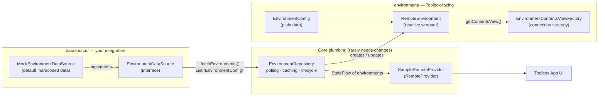
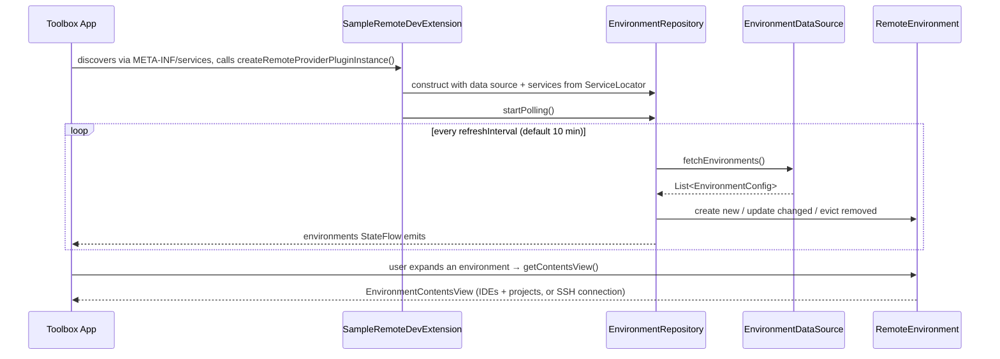

# JetBrains Toolbox Plugin Development Template

A starter template for building JetBrains Toolbox App plugins with Gradle. Use this project as a foundation for creating your own Toolbox plugin that lists and connects to remote development environments.

The template ships with a working mock provider: build it, install it, and two fake environments ("Backend Dev Space" and "Frontend Dev Space") appear in Toolbox. From there, implementing your own plugin is mostly a matter of replacing the mock data source and choosing how connections are made.

## Table of Contents

- [Prerequisites](#prerequisites)
- [Quick Start](#quick-start)
- [Architecture](#architecture)
- [Project Layout](#project-layout)
- [Where to Change What](#where-to-change-what)
- [Implementation Guide](#implementation-guide)
- [Build System](#build-system)
- [Commands](#commands)
- [Installing Your Plugin](#installing-your-plugin)
- [Publishing to the JetBrains Marketplace](#publishing-to-the-jetbrains-marketplace)
- [Known Issues](#known-issues)
- [Resources](#resources)

## Prerequisites

- **JDK 21** or later
- **JetBrains Toolbox App** (2.x)

## Quick Start

```bash
# Build and install the plugin into your local Toolbox App
./gradlew installPlugin

# Then fully restart the Toolbox App (Quit, not just close the window).
# A "Sample Provider" section with two mock environments should appear.
```

If the provider doesn't show up, check the Toolbox logs (macOS: `~/Library/Logs/JetBrains/Toolbox/toolbox.log`) — the plugin logs a line like `Sample Remote Provider initialized with MockEnvironmentDataSource` on successful load.

## Architecture

The plugin follows a layered design that keeps **data fetching** (your API, CLI, config files) separate from the **Toolbox API surface** (what Toolbox renders and connects to). You should be able to build a real integration by only touching the data-source layer and the connection strategy, without restructuring anything else.



### How it boots and runs



### Component responsibilities

| Component | File | Responsibility |
|---|---|---|
| `SampleRemoteDevExtension` | `SamplePlugin.kt` | **Entry point.** Toolbox instantiates this via the `META-INF/services` file. Wires the data source, repository, and provider together using services (logger, coroutine scope, localization) from the `ServiceLocator`. |
| `EnvironmentDataSource` | `datasource/EnvironmentDataSource.kt` | Interface with one method: `fetchEnvironments(): List<EnvironmentConfig>`. Pure data fetching — no Toolbox types, no lifecycle. This is the main thing you implement. |
| `MockEnvironmentDataSource` | `datasource/MockEnvironmentDataSource.kt` | Default implementation returning two hardcoded environments. Replace it, or keep it around as test/fallback data. |
| `EnvironmentConfig` | `environment/EnvironmentConfig.kt` | Immutable snapshot of one environment (id, name, host, port, IDE codes, project paths, tags). The contract between your data source and the rest of the plugin. |
| `EnvironmentRepository` | `EnvironmentRepository.kt` | Orchestrator. Polls the data source, caches `RemoteEnvironment` instances by id (so reactive subscriptions survive refreshes), updates configs in place, evicts environments that disappeared, and exposes everything as a `StateFlow`. |
| `RemoteEnvironment` | `environment/RemoteEnvironment.kt` | Implements Toolbox's `RemoteProviderEnvironment`. Wraps a config in reactive state (`name`, `state`, `description` flows) that the Toolbox UI observes, and produces the contents view on demand. |
| `EnvironmentContentsViewFactory` | `environment/EnvironmentContentsViewFactory.kt` | Strategy interface for *how Toolbox connects* to an environment. Swap the implementation here to change the connection type without touching the repository. |
| `ManualContentsViewFactory` | `environment/ManualContentsViewFactory.kt` | Default strategy: a static list of IDEs and projects built from the config (`ManualEnvironmentContentsView`). No live connection. |
| `SampleRemoteProvider` | `SampleRemoteProvider.kt` | Implements Toolbox's `RemoteProvider`. Thin — delegates the environment list to the repository. Also where the provider name, `handleUri`, and new-environment capability live. |

### Why the layering?

- **Data sources return `EnvironmentConfig`, not `RemoteEnvironment`.** Configs are plain data, so a data source can be unit-tested without any Toolbox dependencies, and the repository stays the single owner of environment lifecycle.
- **The repository caches environments by id.** On each refresh it *updates* existing `RemoteEnvironment` instances instead of recreating them. This matters because Toolbox holds reactive subscriptions to each environment's flows — recreating instances every poll would break UI state.
- **The contents-view factory is injected.** Connection strategy (manual list vs. SSH vs. custom agent) is orthogonal to where environment data comes from, so they're separate seams.

## Project Layout

```
ToolboxSamplePlugin/
├── settings.gradle.kts                  # Root name, includes :plugin, wires build-logic + Toolbox Maven repo
├── gradle/libs.versions.toml            # All dependency versions (Toolbox API, Kotlin, coroutines)
├── build-logic/                         # Custom Gradle plugins (packaging, install, publish)
│   └── src/main/kotlin/toolbox/buildlogic/
│       ├── ToolboxGenerateJsonExtension.kt  # Generates extension.json (plugin metadata)
│       ├── InstallToolboxPlugin.kt          # `installPlugin` task → copies into local Toolbox
│       └── PublishToolboxPlugin.kt          # `packagePlugin` + `publishPlugin` tasks → Marketplace
└── plugin/                              # The actual Toolbox plugin
    ├── build.gradle.kts                 # Plugin ID (group), version, vendor
    └── src/main/
        ├── kotlin/toolbox/gateway/sample/
        │   ├── SamplePlugin.kt          # Entry point (SampleRemoteDevExtension)
        │   ├── SampleRemoteProvider.kt  # RemoteProvider implementation
        │   ├── EnvironmentRepository.kt # Polling, caching, lifecycle
        │   ├── datasource/              # ← implement your data fetching here
        │   └── environment/             # ← Toolbox-facing config, environment, views
        └── resources/
            ├── META-INF/services/com.jetbrains.toolbox.api.remoteDev.RemoteDevExtension
            │                            # Registers your extension class — update if you rename/move it
            ├── dependencies.json        # Third-party licenses shown to users — keep in sync with libs.versions.toml
            ├── icon.svg                 # Plugin icon
            └── localization/defaultMessages.po
```

## Where to Change What

The quick-reference map. "I want to…" → edit this:

| I want to… | Edit |
|---|---|
| Fetch environments from my real backend/API/CLI | Create a new class implementing `EnvironmentDataSource` in `datasource/`, then return it from `createDataSource()` in `SamplePlugin.kt` |
| Change what data an environment carries (add fields) | `environment/EnvironmentConfig.kt`, then use the new fields in your contents-view factory |
| Change how Toolbox connects (SSH, custom agent, port forwarding) | New `EnvironmentContentsViewFactory` implementation in `environment/`, injected via the `contentsViewFactory` parameter of `EnvironmentRepository` in `SamplePlugin.kt` |
| Change the provider name shown in Toolbox | `SampleRemoteProvider.kt` — the string passed to `RemoteProvider("Sample Provider")` |
| Change the plugin ID / version / vendor | `plugin/build.gradle.kts` — `group` (this **is** the plugin ID), `version`, `extra["vendor"]` |
| Change the Marketplace-facing name, description, URL | `build-logic/.../ToolboxGenerateJsonExtension.kt` — `metaName`, `metaDescription`, `metaUrl` |
| Change the polling frequency | `refreshInterval` parameter of `EnvironmentRepository` (default 10 minutes) |
| Support deep links (`jetbrains://…`) | `handleUri()` in `SampleRemoteProvider.kt` |
| Let users create environments from Toolbox | `canCreateNewEnvironments` in `SampleRemoteProvider.kt` (plus the related `RemoteProvider` overrides) |
| React to environment status changes (health checks, errors) | Call `repository.updateEnvironmentState(id, state, errorMessage)` — see `EnvironmentRepository.kt` |
| Clean up when a user removes an environment | `onDelete()` in `environment/RemoteEnvironment.kt` |
| Change the plugin icon | `plugin/src/main/resources/icon.svg` |
| Rename the entry-point class or package | Update the class **and** the line inside `resources/META-INF/services/com.jetbrains.toolbox.api.remoteDev.RemoteDevExtension` — Toolbox won't find your plugin otherwise |
| Bump the Toolbox API or Kotlin version | `gradle/libs.versions.toml` (and mirror versions in `resources/dependencies.json`) |
| Change Marketplace release notes | `PublishToolboxPlugin.kt` — the `"Bug fixes and improvements"` string in `PublishTask` |

## Implementation Guide

A suggested order for turning the template into your plugin.

### 1. Claim your plugin identity

In `plugin/build.gradle.kts`:

```kotlin
group = "com.yourcompany.toolbox.yourplugin"  // becomes the plugin ID everywhere
version = "1.0.0"
extra["vendor"] = "Your Company"
```

The `group` is used as the plugin ID in `extension.json`, the install directory name, the ZIP layout, and the Marketplace XML ID — you set it once here and the build logic propagates it. Also update the display name/description in `ToolboxGenerateJsonExtension.kt` and the provider name in `SampleRemoteProvider.kt`.

### 2. Implement your data source

Create a class in `datasource/` implementing the single-method interface:

```kotlin
class MyApiDataSource(private val logger: Logger) : EnvironmentDataSource {
  override suspend fun fetchEnvironments(): List<EnvironmentConfig> {
    // call your API / run your CLI / read your config
    // map results to EnvironmentConfig
    // wrap failures in DataSourceException so the repository logs them
  }
}
```

Then swap it in at the one seam designed for it — `createDataSource()` in `SamplePlugin.kt`. Throw `DataSourceException` on failure: the repository catches it, logs it, and keeps the previously loaded environments instead of wiping the list.

### 3. Choose your connection strategy

This is the first major design decision: how does Toolbox actually connect to an environment when the user clicks it? The strategy lives entirely in your `EnvironmentContentsViewFactory` implementation.

| View type | When to use | Effort |
|---|---|---|
| `ManualEnvironmentContentsView` (template default) | You know IDEs/projects upfront; no live connection. Good for early development and as fallback data. | Low |
| `SshEnvironmentContentsView` | Environments are reachable over SSH and Toolbox should manage the connection. | **Low — recommended starting point for real connections** |
| `AgentConnectionBasedEnvironmentContentsView` | You run your own agent/protocol inside the environment. | High |
| `PortForwardingCapableEnvironmentContentsView` | Complex scenarios needing port forwarding. | High |

`EnvironmentConfig` already carries `host`, `port`, and `username` for an SSH-based factory. You can also mix strategies per environment — the factory receives the config, so it can pick a view type based on tags or reachability, and fall back to a manual view when a connection isn't possible.

### 4. Report real environment states

The template marks everything `Active`. For a real integration, map your backend's status (starting, stopped, unreachable…) to `StandardRemoteEnvironmentState` values — either in the polling path or by calling `repository.updateEnvironmentState()` from a health check. The state drives the status badge users see in Toolbox.

### 5. Optional polish

- **Deep links:** implement `handleUri()` in `SampleRemoteProvider.kt` so links can open specific environments.
- **UI / authentication:** this template contains no custom UI. If you need login screens or settings pages, see the [Toolbox UI API](https://www.jetbrains.com/help/toolbox-app/ui-api.html#toolboxUI).
- **Licenses:** update `resources/dependencies.json` to list the third-party libraries your plugin actually ships.
- **Cleanup:** put teardown logic in `RemoteEnvironment.onDelete()` and `SampleRemoteProvider.close()`.

## Build System

Build logic is decoupled from the plugin itself: `build-logic/` is an [included build](https://docs.gradle.org/current/userguide/composite_builds.html) providing three Gradle plugins, all applied in `plugin/build.gradle.kts`. You generally don't need to touch these unless you're changing packaging or metadata behavior.

| Gradle plugin | Task(s) it adds | What it does |
|---|---|---|
| `com.jetbrains.toolbox.packaging` | `generateExtensionJson` (hooked into `assemble`) | Generates `build/generated/extension.json` — the manifest Toolbox reads — from `group`, `version`, `vendor`, and the metadata in `ToolboxGenerateJsonExtension.kt` |
| `com.jetbrains.toolbox.install` | `installPlugin` | Builds, then copies the jar + `extension.json` + `dependencies.json` + `icon.svg` into your local Toolbox plugins directory |
| `com.jetbrains.toolbox.publish` | `packagePlugin`, `publishPlugin` | Zips the plugin in the Marketplace-required layout and uploads it |

The Marketplace ZIP produced by `packagePlugin` looks like:

```
plugin-1.1.0.zip
├── extension.json                      # at the root
└── <plugin-id>/                        # directory named after your group
    ├── dependencies.json
    ├── icon.svg
    └── lib/
        └── plugin-1.1.0.jar
```

The Toolbox plugin API dependencies are `compileOnly` — the Toolbox App provides them at runtime, so they are deliberately not bundled in the jar.

## Commands

| Command | Description |
|---|---|
| `./gradlew :plugin:assemble` | Compile and generate `extension.json` |
| `./gradlew :plugin:build` | Build and run tests (none here) |
| `./gradlew installPlugin` | Build and install directly into the local Toolbox App |
| `./gradlew packagePlugin` | Produce the Marketplace-ready ZIP in `plugin/build/distributions/` |
| `./gradlew publishPlugin` | Package and upload to the JetBrains Marketplace |
| `./gradlew clean` | Clean all build outputs |

## Installing Your Plugin

`./gradlew installPlugin` handles this for you. To install manually instead, copy the jar, `extension.json`, `dependencies.json`, and `icon.svg` into a directory named after your plugin ID:

- **Windows:** `%LocalAppData%/JetBrains/Toolbox/cache/plugins/<plugin-id>`
- **macOS:** `~/Library/Caches/JetBrains/Toolbox/plugins/<plugin-id>`
- **Linux:** `~/.local/share/JetBrains/Toolbox/plugins/<plugin-id>`

Fully restart the Toolbox App after installing — it only scans for plugins on startup.

## Publishing to the JetBrains Marketplace

1. Generate a token from your [JetBrains Marketplace](https://plugins.jetbrains.com) account.
2. Export it: `export JETBRAINS_MARKETPLACE_PUBLISH_TOKEN=<token>`
3. Run `./gradlew publishPlugin`.

First-time uploads are created **hidden** on the Marketplace with the Apache 2.0 license and `toolbox`/`gateway` tags — review the settings in `PublishToolboxPlugin.kt` before publishing (the license choice is yours; the tags and product family must stay as-is). Subsequent runs upload an update to the existing plugin; remember to change the hardcoded release notes in `PublishTask` for each release.

## Known Issues

- **Kotlin 2.1.0 + `MutableStateFlow`:** a compiler bug ([KT-73951](https://youtrack.jetbrains.com/issue/KT-73951)) requires the `-Xdisable-phases=ConstEvaluationLowering` workaround present in both `plugin/build.gradle.kts` and `build-logic/build.gradle.kts`. Remove it once you upgrade to a Kotlin version containing the fix.

## Resources

- [Toolbox App plugin documentation](https://www.jetbrains.com/help/toolbox-app/) — official API docs
- [Toolbox UI API](https://www.jetbrains.com/help/toolbox-app/ui-api.html#toolboxUI) — for building custom UI/auth flows
- [Coder's open-source Toolbox plugin](https://github.com/coder/coder-jetbrains-toolbox/tree/main) — a production plugin using the same API
